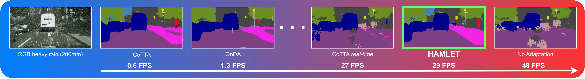

# 💀 HAMLET

## To Adapt or Not to Adapt? Real-Time Adaptation for Semantic Segmentation (ICCV23)
[Marc Botet Colomer](https://github.com/MarcBotet)<sup>1,2*</sup> [Pier Luigi Dovesi](https://github.com/pierluigidovesi)<sup>3*†</sup> [Theodoros Panagiotakopoulos](https://github.com/theo2021)<sup>4</sup> [Joao Frederico Carvalho](https://scholar.google.se/citations?user=-GqJRNoAAAAJ&hl=sv) <sup>1</sup> [Linus Härenstam-Nielsen](https://github.com/Linusnie)<sup>5,6</sup> [Hossein Azizpour](https://scholar.google.se/citations?user=t6CRgJsAAAAJ&hl=en)<sup>2</sup> [Hedvig Kjellström](https://scholar.google.com/citations?user=wr3CtKAAAAAJ&hl=en)<sup>2,3</sup> [Daniel Cremers](https://scholar.google.com/citations?user=cXQciMEAAAAJ&hl=en)<sup>5,6,7</sup> [Matteo Poggi](https://github.com/mattpoggi)<sup>8</sup>

<sup>1</sup> [Univrses](https://univrses.com/) <sup>2</sup> [KTH](https://www.kth.se/en) <sup>3</sup> [Silo AI](https://www.silo.ai/) <sup>4</sup> [King](https://www.king.com/) <sup>5</sup> [Technical University of Munich](https://www.tum.de/en/) <sup>6</sup> [Munich Center of Machine Learning](https://mcml.ai/) <sup>7</sup> [University of Oxford](https://www.ox.ac.uk/) <sup>8</sup> [University of Bologna](https://www.unibo.it/en)

<sup>*</sup> Joint first authorship.
<sup>†</sup> Part of the work carried out while at Univrses.

📜 [arxiv](https://arxiv.org/abs/2307.15063)
💀 [project page](https://marcbotet.github.io/hamlet-web/)
📽️ [video](https://www.youtube.com/watch?v=zjxPbCphPDE)



## Citation

If you find this repo useful for your work, please cite our paper:

```shell
@inproceedings{colomer2023toadapt,
      title = {To Adapt or Not to Adapt? Real-Time Adaptation for Semantic Segmentation},
      author = {Botet Colomer, Marc and 
                Dovesi, Pier Luigi and 
                Panagiotakopoulos, Theodoros and 
                Carvalho, Joao Frederico and 
                H{\"a}renstam-Nielsen, Linus and 
                Azizpour, Hossein and 
                Kjellstr{\"o}m, Hedvig and 
                Cremers, Daniel and
                Poggi, Matteo},
      booktitle = {IEEE International Conference on Computer Vision},
      note = {ICCV},
      year = {2023}
}
```

## Setup Environment

For this project, we used Python  3.9.13. We recommend setting up a new virtual
environment:

```shell
python -m venv ~/venv/hamlet
source ~/venv/hamlet/bin/activate
```

In that environment, the requirements can be installed with:

```shell
pip install -r requirements.txt -f https://download.pytorch.org/whl/torch_stable.html
pip install mmcv-full==1.3.7  # requires the other packages to be installed first
```

All experiments were executed on a NVIDIA RTX 3090


## Setup Datasets

**Cityscapes:** Please, download leftImg8bit_trainvaltest.zip and
gt_trainvaltest.zip from [here](https://www.cityscapes-dataset.com/downloads/)
and extract them to `/data/datasets/cityscapes`.

**Rainy Cityscapes:** Please follow the steps as shown here: https://team.inria.fr/rits/computer-vision/weather-augment/

We refer to [MMSegmentation](https://github.com/open-mmlab/mmsegmentation) for further instructions about the dataset structure.

Prepare the source dataset:

```shell
python tools/convert_datasets/cityscapes.py /data/datasets/Cityscapes --out-dir data/Cityscapes --nproc 8
```

## Training

For convenience, it is possible to run the configuration selecting experiment -1. If wandb is configurated can be activated by setting the wandb argument to 1

```shell
python run_experiments.py --exp -1 --wandb 1
```
All assets to run a training can be found [here](https://drive.google.com/drive/folders/1p3VoGrsQsI7wMCYeAb7nYEImW0oIrmMR?usp=sharing).

Make sure to place the pretrained model `mitb1_uda.pth` in `pretrained/`.

We provide a `config.py` file that can be easily modified to run multiple experiments by changing parameters. Make sure to place the random modules to `random_modules/`.

## Code structure
This code is based on MMSegmentation project. The most relevant files are:

* [online_src/domain_indicator_orchestrator.py](online_src/domain_indicator_orchestrator.py): Implementation of the Adaptive Domain Detection.
* [online_src/online_runner.py](online_src/online_runner.py): Runner for Hamlet.
* [online_src/buffer.py](online_src/buffer.py): Buffer sampling methods
* [mmseg/models/segmentors/modular_encoder_decoder.py](mmseg/models/segmentors/modular_encoder_decoder.py): Implementation of HAMT
* [mmseg/models/decode_heads/incremental_decode_head.py]([mmseg/models/decode_heads/incremental_decode_head.py): Handle the lightweight decoder
* [mmseg/models/decode_heads/segformer_head.py]([mmseg/models/decode_heads/segformer_head.py): Implementation of the lightweight decoder on SegFormer
* [mmseg/models/backbones/mix_transformer.py]([mmseg/models/backbones/mix_transformer.py): Implementationf of modular freezing for HAMT
* [mmseg/models/uda/dacs.py]([mmseg/models/uda/dacs.py): UDA method using hamlet strategies
* [mmseg/core/evaluation/eval_hooks.py]([mmseg/core/evaluation/eval_hooks.py): Evaluation methods

## Acknowledgements

This project is based on the following open-source projects.

* [MMSegmentation](https://github.com/open-mmlab/mmsegmentation)
* [DAFormer](https://github.com/lhoyer/DAFormer)
* [SegFormer](https://github.com/NVlabs/SegFormer)
